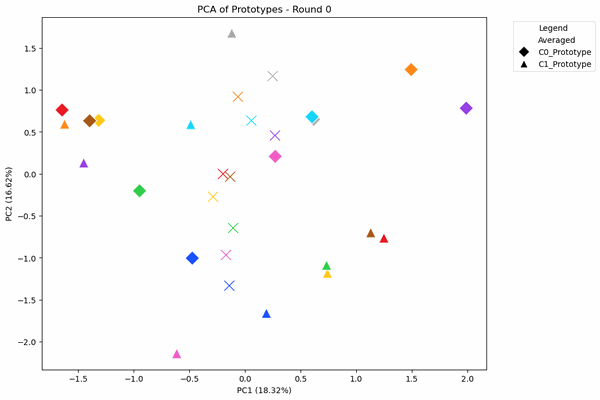
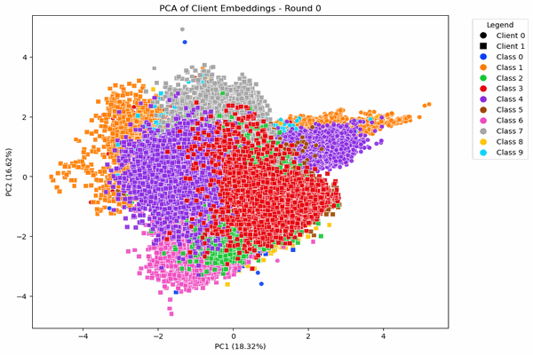
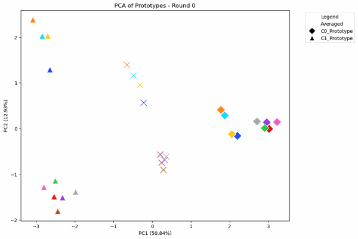
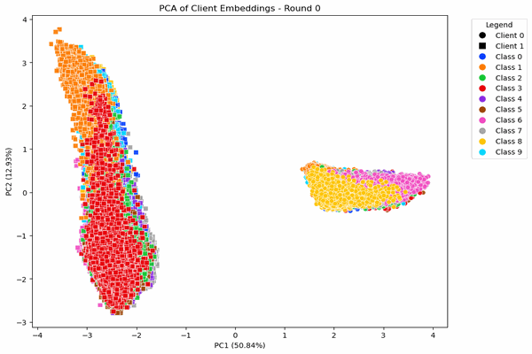
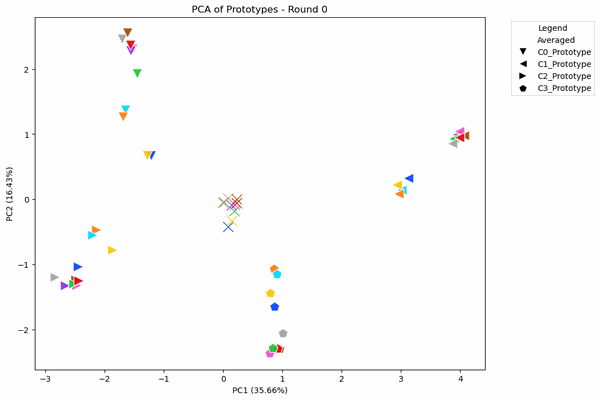

# FedEmbed

## Motivation
In federated learning, privacy concerns require that training data remains decentralized, with models trained locally on each client's data rather than shared with a central server. The FedAvg algorithm addresses this by allowing each client to train the model locally on private data, then sharing only the trained weights with the server. The server aggregates these weights and distributes them back to the clients in each communication round. Through this process, each client benefits from other clients' information without directly accessing their data.

In highly non-iid settings (where data distributions vary significantly across clients), the aggregated weights may lose effectiveness due to client drift, where differing updates from each client may cancel each other out or have minimal impact.

This project seeks to explore federated learning for classification without relying on a softmax layer, instead using a nearest-neighbor-based classification method. The goal is to mitigate client drift by adjusting the embedding space, aiming to minimize intra-class distance and maximize inter-class distance among data samples across clients.

## Methodology
Terminology, inspired from this [paper: Semantic drift compensation](https://openaccess.thecvf.com/content_CVPR_2020/papers/Yu_Semantic_Drift_Compensation_for_Class-Incremental_Learning_CVPR_2020_paper.pdf)
- prototypes:  Class representatives calculated as the average of all data samples in the embedding space for each class.

The approach focuses on aligning prototypes of the same class across different clients, making them as close as possible in the embedding space, while maximizing the distance between prototypes of different classes across clients.

## Visualisation of results
The visualization demonstrates that the proof of concept is valid: prototypes of the same class from different clients progressively move closer across iterations, even without additional regularization. However, further study is needed to explore effective methods for increasing the separation between prototypes of different classes.

### MNIST (Easy scenario)

#### Prototypes visualisation (2 Client)

#### Data samples in embedding space visualisation (2 Client)

### CIFAR10 (Difficult scenario)

#### Prototypes visualisation (2 Client)

#### Data samples in embedding space visualisation (2 Client)

#### Prototypes visualisation (4 Client)

#### Data samples in embedding space visualisation (4 Client)

## Future scope of study
- The performance of a nearest-neighbor-based classifier matches that of FedAvg on the MNIST and CIFAR datasets. Enhancements can be achieved by incorporating a regularization function to increase the intra-class distance between different prototypes.
- The objective is to explore whether manipulating the embedding space can compensate for client drift in extreme non-iid settings by drawing inspiration from drift compensation in class incremental learning.